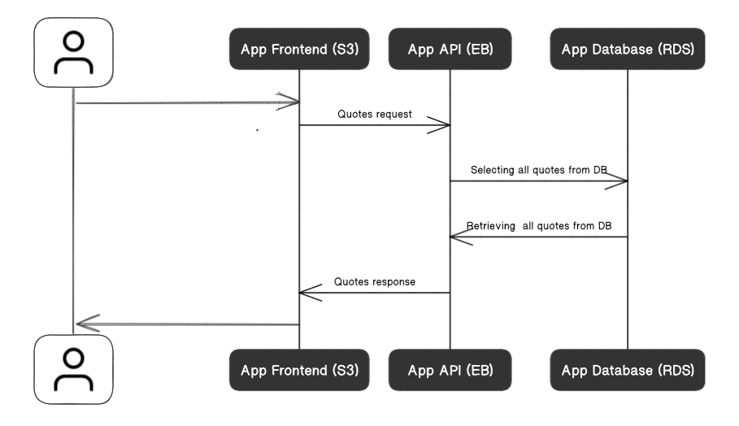
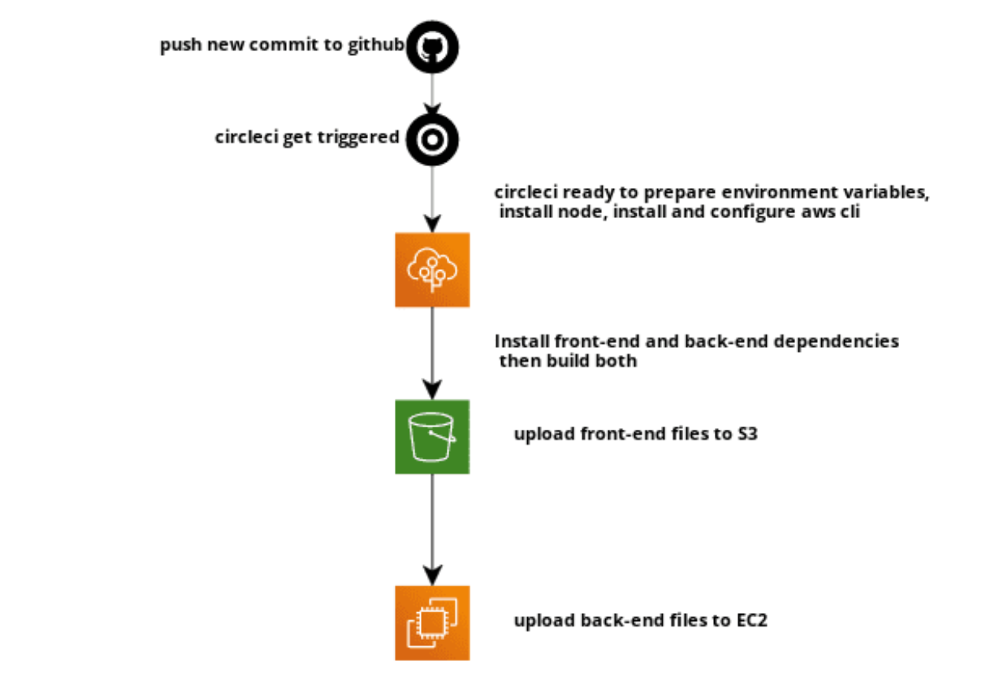

# Quotes CLI Full-stack App

egFWD Advanced Web Development | Project #3

## Description

This Project is the third project in the [egFWD](https://egfwd.com/) initiative (full-stack nanodegree).
It presents a full-stack app that uses AWS services to be hosted. The app uses [AWS S3](https://aws.amazon.com/s3/) for the frontend hosting, [AWS EB](https://aws.amazon.com/elasticbeanstalk/) for the api hosting & [AWS RDS](https://aws.amazon.com/rds/) for the database hosting.  
Live Version: [http://ibnsamy-testing-s3.s3.amazonaws.com/index.html](http://ibnsamy-testing-s3.s3.amazonaws.com/index.html)

## Infrastructure

### RDS

Amazon Relational Database Service is a distributed relational database service by Amazon Web Services. It is a web service running "in the cloud" designed to simplify the setup, operation, and scaling of a relational database for use in applications. And I use it with Postgres.

### EB

AWS Elastic Beanstalk is an easy-to-use service for deploying and scaling web applications and services developed with Java, .NET, PHP, Node.js, Python, Ruby, Go, and Docker on familiar servers such as Apache, Nginx, Passenger, and IIS.
I use it to run the api as a layer between the database and the frontend.

### S3

Amazon S3 or Amazon Simple Storage Service is a service offered by Amazon Web Services that provides object storage through a web service interface.
I use it a bucket hosts the frontend files and provide an endpoint to be accessed.

## Pipeline

CircleCI pipeline is triggered when a new commit is pushed to "main" branch

1. The pipeline starts by installing Node  
   node: circleci/node@5.0.0

2. Then it installs AWS CLI / Elastic Beanstalk CLI  
   aws-cli: circleci/aws-cli@2.0.6  
   eb: circleci/aws-elastic-beanstalk@2.0.1

3. After that it installs the needed dependencies for frontend & backend
4. And Finally it builds the app and deploys it by uploading files to the S3 bucket & Elastic Beanstalk

