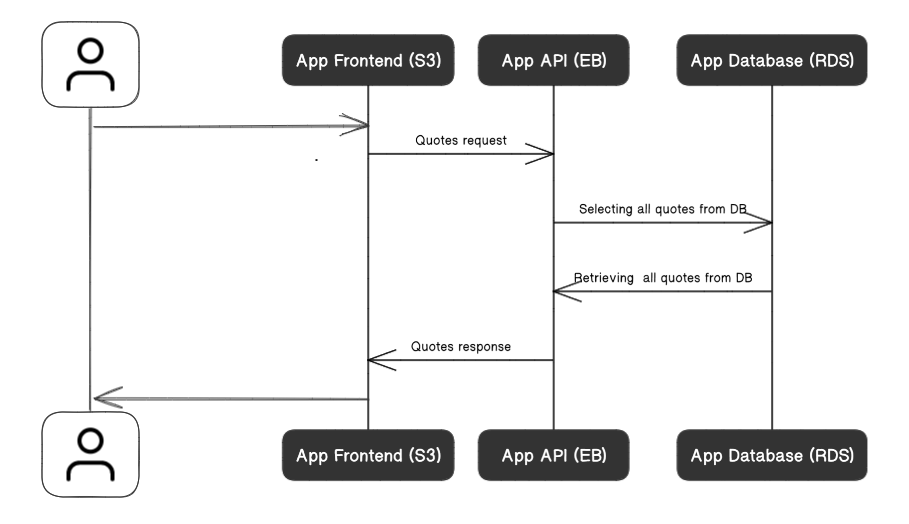

## System Infrastructure:

### RDS

Amazon Relational Database Service is a distributed relational database service by Amazon Web Services. It is a web service running "in the cloud" designed to simplify the setup, operation, and scaling of a relational database for use in applications. And I use it with Postgres.

### EB

AWS Elastic Beanstalk is an easy-to-use service for deploying and scaling web applications and services developed with Java, .NET, PHP, Node.js, Python, Ruby, Go, and Docker on familiar servers such as Apache, Nginx, Passenger, and IIS.
I use it to run the api as a layer between the database and the frontend.

### S3

Amazon S3 or Amazon Simple Storage Service is a service offered by Amazon Web Services that provides object storage through a web service interface.
I use it a bucket hosts the frontend files and provide an endpoint to be accessed.

